# exerciciosPHPaula1
exercícios para treinar o início do aprendizado de php. tudo feito com method get. Aula de PHP na Etec de Guarulhos.
  

  <h3>Primeira parte da página de exercícios</h3>
  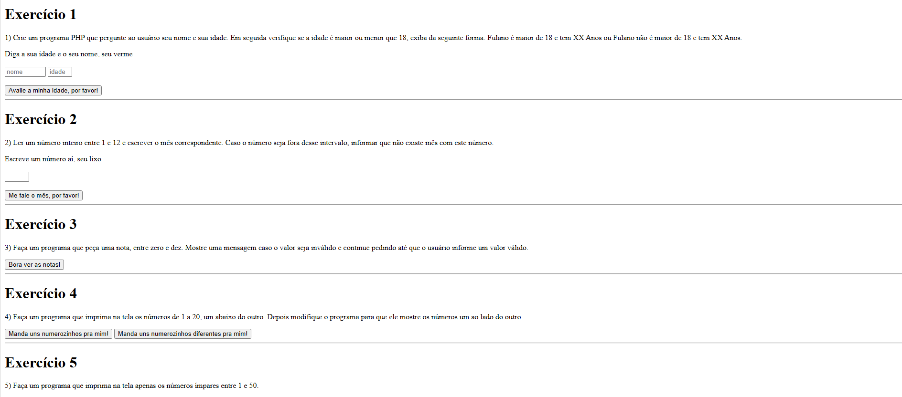

  

  <h3>As respostas aparecem lá embaixo</h3>
  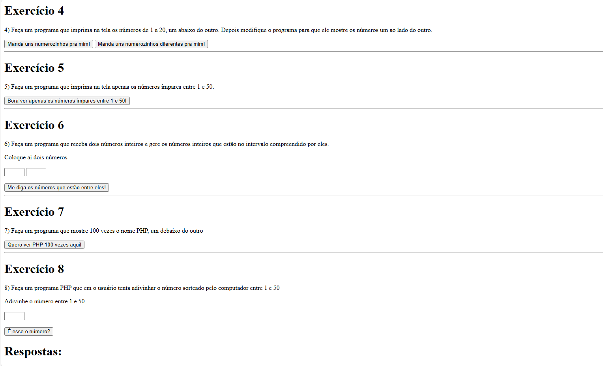

  

  <h3>Respostas das atividades</h3>
  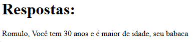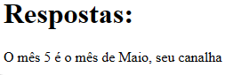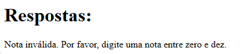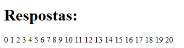

  

  <h3>Demais atividades</h3>
  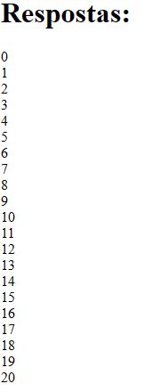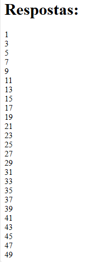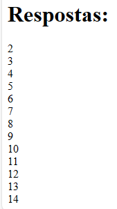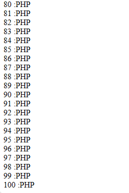

  

  <h3>Última atividade</h3>
  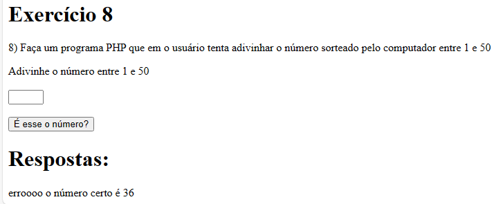

